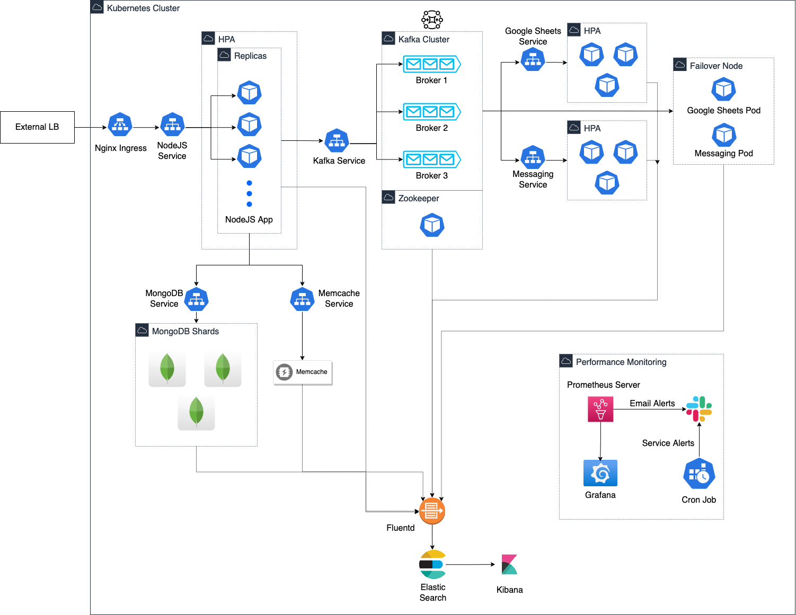

# NodeJS Data Pipeline

A NodeJS app to handle large volumes of user data and process them in a highly available environment.



## Installation

- Install 3rd party CRDs from `/K8s-tools`.
- Create services, deployments, HPAs from `/K8s-config`
    ```bash
    $ kubectl apply -f ./K8s-config
    ```
